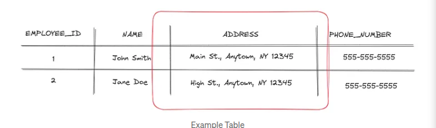
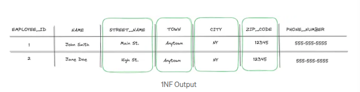
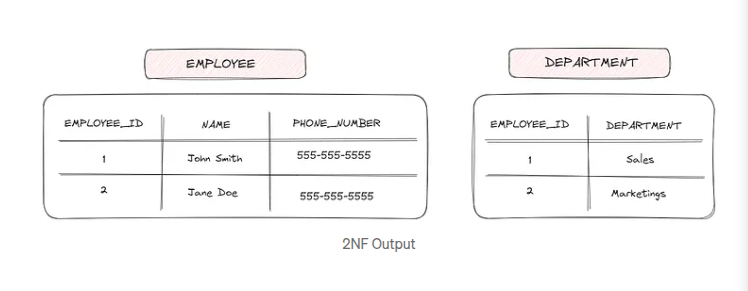
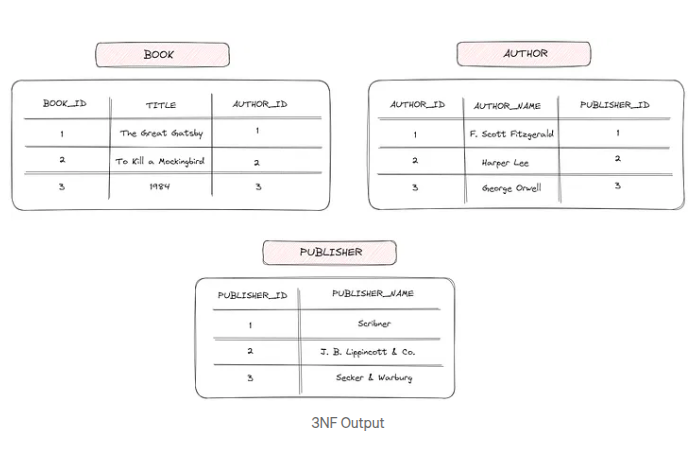
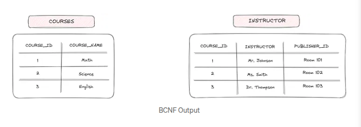
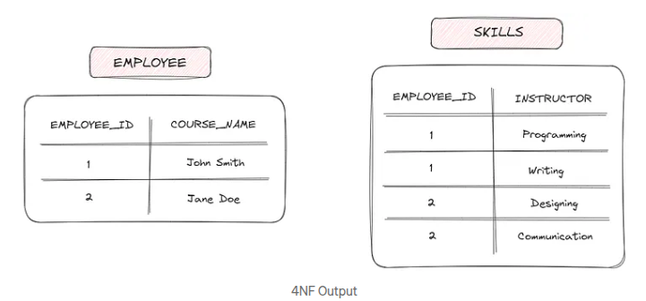
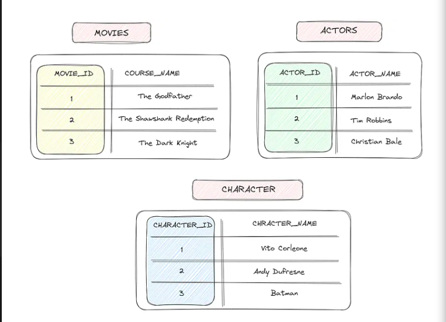
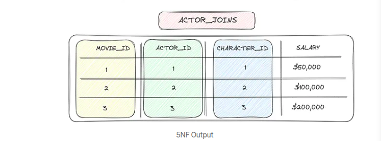

## Database Normalization

- Normalization is the process of reducing a bigger table into smaller table by eliminating redundacy and anomalies.

- In this process we normalize the table where the data in columns can be fetched with a key.

- This helps in organizing the data in the database.

- This process includes the data to be processed into tabular forms while eliminationg redundacy from the relational table.

- It involves breaking down a database into multiple related tables and defining relationship between them.

## Objectives of Data Normalization

- To correct duplicate data and database anomalies.
- Avoid creating and updating any unwanted data connections and dependencies.
- Optimize storage space
- Reduce the delay when new types of data need to be introduced.
- Facilitate the access and view of data to users and product tools.

## Why Normalization ?

- Normalization breaks down a large table into smaller, more manageable tables that are related through common attributes.
- Reduces redundancy by storing each piece of data in only one place and ensures consistency by eliminating data anoalies.
- Normalization also helps to make the database more flexible, efficient, and easier to mantain.

### NOTE:

- **Data redundancy** means repetition of data or duplication of data.
- **Anomalies** means side effects that we have in table or data integrity
- **Normal form** means a table without redundancies and anomalies

## Normal forms

- Are defined structures for relations with set of constraints that relations must satisfy inorders to detect data redundancy and correct anomalies.

### Anomalies while performing a database operation:

1. **insert:** data is known but can not be inserted
2. **update:** updating data requires modification in multiple tuples(rows)
3. **delete:** deleting some data causes some other data to be lost

## Types of Normal Forms

1. **First Normal Form(1NF)**

**First normal form(1NF)** is the simplest level of normalization. it involves ensuring that each table in the database has a primary key and that each column in the table contains atomic values.

- In other words, each row in the table should have a unique identifier, and each value in the table should be indivisible.

**example** :

_Lets take an example to understand. Consider information about **employees**. The table might have columns like **employess_id**, **name**, **address** and **phone_number**. However, the *address* column could contain multiple values, like street name, city, state and zip code_

To bring this table to 1NF, we need to split the **adress** column into separate columns, each containing a single value.

2. **Second Normal Form(2NF)**

**Second normal form(2NF)** builds on the foundation of 1NF and involves ensuring that each non-key column in a table is dependent on the primary key. In other words, there should be no partial dependencies in the table.

_Let’s continue with our employee table example. Suppose we add a column for **department** to the table. If we find that the value in the **department** column is dependent on the **employee_id** and **name** columns, but not on the **phone_number** column, we need to split the table into two tables, one for employee information and one for department information._

3. **Third Normal Form(3NF)**

**Third normal form(3NF)** builds on the foundation of 2NF and involves ensuring that each non-key column in a table is not transitively dependent on the primary key. In other words, there should be no transitive dependencies in the table.

_Let’s take another example. Consider a table that stores information about **books**. The table might have columns like **book_id**, **title**, **author**, and **author**_

_However, the **publisher** column could be dependent on the **author** column, rather than on the **book_id** column. To bring this table to 3NF, we need to split it into two tables, one for book information and one for author information._

4. **BCNF — Boyce-Codd Normal Form**

**BCNF — Boyce-Codd Normal Form** is a higher level of normalization than 3NF. It is used to eliminate the possibility of functional dependencies between non-key attributes. A table is in BCNF if and only if every determinant in the table is a candidate key.

_To understand BCNF better, consider a table that stores information about students and their courses. The table might have columns like **student_id**, **course_id**, **instructor**, and **instructor_office**. In this table, the determinant is course_id, and the non-key attribute is instructor. However, a course can have multiple instructors, so there is a possibility of functional dependencies between non-key attributes. To bring this table to BCNF, we need to split it into two tables, one for course information and one for instructor information._

5. **Fourth Normal Form (4NF)**

**Fourth Normal Form (4NF)** is the highest level of normalization and is used to eliminate the possibility of multi-valued dependencies in a table. A multi-valued dependency occurs when one or more attributes are dependent on a part of the primary key, but not on the entire primary key.

_To understand 4NF better, consider a table that stores information about employees and their skills. The table might have columns like **employee_id**, **skill**, and **proficiency_level**. In this table, the primary key is a combination of **employee_id** and **skill**. However, the proficiency level is dependent on the skill, but not on the entire primary key. To bring this table to 4NF, we need to split it into two tables, one for employee information and one for skill information._

6. **Fifth Normal Form (5NF)**

**Fifth Normal Form (5NF)** is the highest level of normalization and is also known as Project-Join Normal Form (PJNF). It is used to handle complex many-to-many relationships in a database.

- In a many-to-many relationship, where each table has a composite primary key, it is possible for a non-trivial functional dependency to exist between the primary key and a non-key attribute. 5NF deals with these situations by decomposing the tables into smaller tables that preserve the relationships between the attributes.

_To understand this better, consider a database that stores information about movies and their actors. The tables might have columns like **movie_id**, **actor_id**, **character_name**, and **salary**. In this database, it is possible for a non-trivial functional dependency to exist between the primary key (**movie_id**, **actor_id**) and the salary attribute._

_To bring this database to 5NF, we need to decompose the tables into smaller tables. For example, we might create tables for movies, actors, and characters, and then use a join table to connect them. Each table would have a single primary key, and the join table would include foreign keys to the other tables._

### De-normalization

- It is a process of combining more than one smaller table to form a bigger table is known as De-normalization.
- De-normalization can improve performance by reducing the number of joins required to retrieve data from a database, which can be especially useful for large databases or complex queries.
- However, it can also lead to data inconsistencies and maintenance difficulties if not properly managed.
